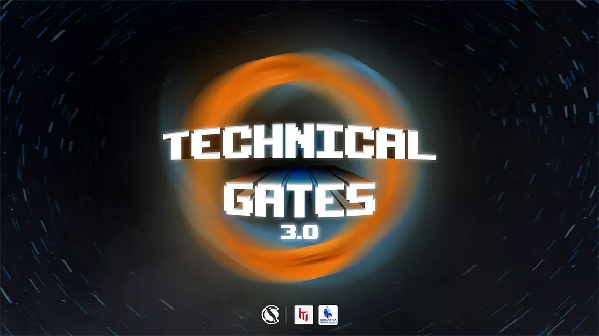

# CIS Technical Gates 3.0

Fields and Technologies increase every day and with them increase our questions and our thinking about the first step, and how will we start with the track we have chosen and is it the right track for us? With you, the task is for the end, and as we started through Gateway and we knew an introduction to each field of computer, now it is our turn to complete what we started and apply everything we understood about the tracks in a practical way in Technical Gates 3.0, with distinguished people in their fields who have gone through many experiences, and they have experience enough to help others know more about each field, and gain practical skills that benefit them in practicing the track they chose.

## Front-end Tasks
 
* [First Session](https://github.com/AmrBedir/CIS_Technical_Gates/tree/main/Front-End_First_Session)
   * [Product preview card component challenge on Frontend Mentor.](https://www.frontendmentor.io/challenges/product-preview-card-component-GO7UmttRfa)
* [Second Session](https://github.com/AmrBedir/CIS_Technical_Gates/tree/main/Front-End_Second_Session)
     * [Base Apparel coming soon page challenge on Frontend Mentor.](https://www.frontendmentor.io/challenges/base-apparel-coming-soon-page-5d46b47f8db8a7063f9331a0)

* [Third Session](https://github.com/AmrBedir/CIS_Technical_Gates/tree/main/Front-End_Third_Session)
     * [Sunnyside agency landing page challenge on Frontend Mentor.](https://www.frontendmentor.io/challenges/sunnyside-agency-landing-page-7yVs3B6ef)

## Mentors  

* [Eng. Alaa Yasser](https://linkedin.com/in/alaayasser741/)
* [Eng. Merhan Mostafa](https://linkedin.com/in/merhanmostafa47/)

## Give a Star! ⭐️
If you find this repository useful, please give it a star. Thanks!
